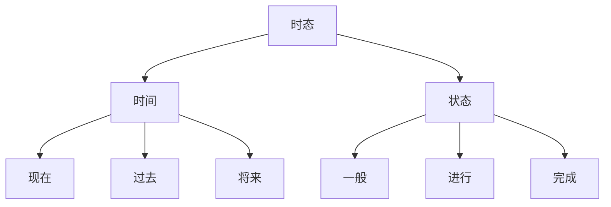
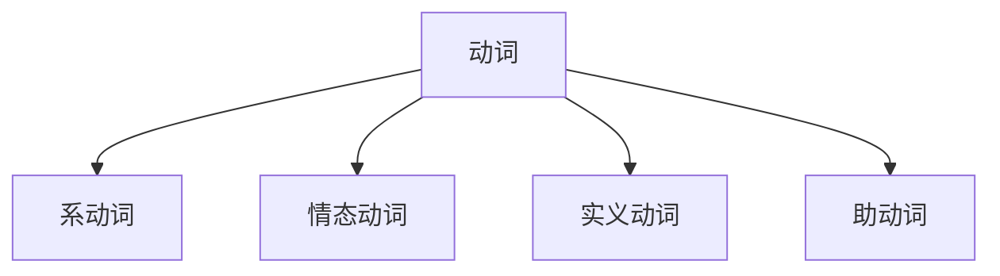

# 你知道词性的重要性吗二
## 动词有多重要？
动词相当于数学中的函数。
## 动词为什么重要？
学习动词，就是学习句子，时态，词组。
### 句子
### 时态
```
一般现在时态:
1. 何时用？
   1. 经常的状态；
   2. 习惯的动作；
   3. 真理；
2. 结构？
   1. 经常的状态：主语+is\am\are
   2. 习惯的动作：主语+v.(动词)
   3. 真理：主语+is\am\are,主语+v.(动词)
- They (are) very bad.
- They often (write) to me.
- The earth (is) round.
- The sun (rises) in the east.
3. 动词？ 主语+v.(动词)
   1. 主语为非三单+动词原形
   2. 主语为非三单+动词s\es
- He (loves) his grilfriend very much.
- Jim and Lily (walk) to school every day.
- They (drink) beer every night.
- My dog (watches) TV at night.
```
```
现在进行时态：
1. 何时用？
   此时刺客正在做。最近一段时间在做也可以。
2. 结构：
   主语+is\am\are+doing
3. 动词？
   1. 一般+ing；
   2. 以不发音的e结尾，去e+ing；
   3. 辅音+元音+辅音（汉堡包结构），双写辅音字母+ing，除opening.
- They are walking.
- They are talking.
```
```
现在完成时态：
1. 何时用？
   1. 截止现在已经完成；
   2. 表示持续；（我已经再北京住了十年了）
2. 结构：
   主语+has\have+done.
3. 动词？
   1. 一般情况+ed,call--called;air--aired;
   2. 以字母e结尾+d，live--lived;love--loved;
   3. 以辅音字母+y结尾，变y为i+ed,try--tried;study--studied;
   4. 辅音+元音+辅音（汉堡包结构），将辅音字母双写+ed，stop--stopped.
- 我已经给房间通过风了。 I have aired the room.
- 他们住在北京已经10年了。 They have lived in Beijing ten years.
```
```
一般过去时态：
1. 何时用？
   1. 过去经常的状态；（她以前很漂亮，他以前是老师）
   2. 过去习惯的动作；（她以前经常起的很早，他去年经常去游泳）
2. 结构：
   1. 过去经常的状态：主语+was\were
   2. 过去习惯的动作：主语+v.(动词过去式)
 3. 动词？（规则动词与现在完成时变化一样）
    1. 一般情况+ed,call--called;air--aired;
    2. 以字母e结尾+d，live--lived;love--loved;
    3. 以辅音字母+y结尾，变y为i+ed,try--tried;study--studied;
    4. 辅音+元音+辅音（汉堡包结构），将辅音字母双写+ed，stop--stopped.
- 我2010年再美国学习。 I studied in the US in 2010.
- 公车刚刚停下来了。 The bus stopped just now.
```
```
过去进行时态：
1. 功能：过去某一时刻、时段正发生的动作
2. 结构：主语+was\were+doing
- She (was doing her homework) at 10:00 last night.
- They (were having a date) from 7:00-9:00 yesterday.
```
```
过去完成时态：
1. 功能：过去某一时刻之前发生的动作、状态
2. 结构：主语+had+done
- She had done her homework (before 10:00 last night)
- The rain (had) already stopped before 8:00 this morning.
```
```
一般将来时态：
1. 主语+is\am\are going to (be +非动词)
2. 主语+will\shall+v.(be+非动词)
- 你会迟到的。 You will be late.
- 演讲者将是我们的老朋友约翰。 The speaker will be our old friend.
- 明天天气晴好。 It's going to be fine tommorrow.
```
```
过去将来时态：(宾语从句转化时极有可能遇到)
1. 主语+was\were going to
2. 主语+would+v.
- 那年他20岁了，三年后他是23岁。 He was 20 years old at that time.In Three years,(he would be) 23 years old.
- 他昨天告诉我他会来北京的。 He told me (he would come) to Beijing.
```
### 词组
## 动词的分类
### 系动词
```
1. be动词(is,am,are,be,was,were,been)
2. get\become "变得"
3. look,sound,sell,taste\feel "感官动词"
```
### 情态动词
```
1. 概念：表示情感、态度
   1. You must stand up!
   2. Can you please stand up?
2. 包括：can,must,may...
3. 用法：+动词，且原形。  He can (do\read\write...) it.
4. 没有人称和数的改变
   1. She is...   She (can)...
   2. I am...     I (can)...
   3. They are... They (can)...
5. 疑问句：提前 (I can speak english) (can you speak english?)
6. 否定句：can--can't , cannot(can not 分开写书面语很少用，语气强烈),must--mustn't(禁止),may--may not
```
### 实义动词
```
实义动词在不同时态下的改变：
1. do(动词原型)
2. does(三单形式)
3. doing(过去、现在进行时)
4. did(过去式)
5. done(过去分词)
```
### 助动词
```
没有实际意义，来帮忙的~
1. 主语+(is\am\are)+doing
2. 主语+(was\were)+doing
3. 主语+(is\am\are going to)+do
4. 主语+(have\has)+done
```


