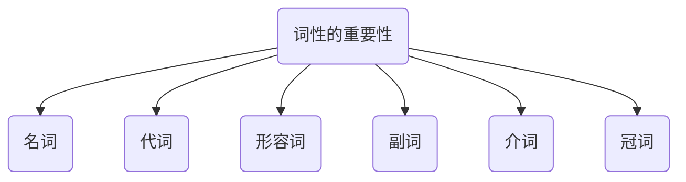
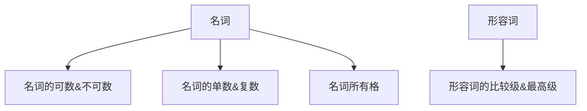
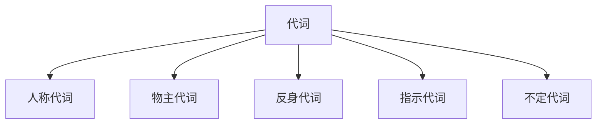
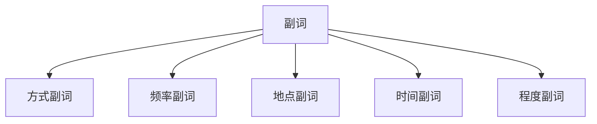

# 你知道词性的重要性吗？ 一
```
? go to school
  go home
  go abroad

? I have been to Hainan.
  I have been there.
  I have been here.

Q 为什么只有前两句加了介词to？
  因为：副词可以直接修饰动词（home，abroad，there，here）
```
## 名词（定义和功能）
定义：表示人或物的词（父亲、母亲、铅笔、电话）
功能：作主语、表语、宾语
```
如： (My boss)主语 is (a football fan)表语.
     我的老板是个足球迷。
    (Momey)主语 doesn't always bring (happiness)宾语.
     金钱并不是总是带来幸福。
```
### 名词的可数&不可数
不可数名词少量，大多数名词是可数的。
不可数：不可以数的、不可以计算的名词。
```
液体状的：water\tea\coffee\milk\beer
物质名词：soap\air\chocolate\rice
抽象名词：love\friendship\happiness
```
不可数名词用法：
```
A·前面不可以加a\an;
B·前面不可以加one,two,three;
C·后面不可以加s,永远是单数;
```
不可数名词+量词
```
(four cups of) tea
(two bars of) chocolate
(two tins of) cola
```
```
1). There __ some bread on the table. (some bread不可数单数，使用is)
  A.is  B.are
2). I am thirsty.Would you bring __,please. (A,C都是不可数，答案本身错误)
  A.some waters B.some tea  C.some soups  D.some eggs
3). There __ two bars of soap in the bathroom. (两块肥皂，可数)
  A.is  B.are
```
### 名词的单数&复数
```
1). 们 -- s (加s变成复数形式)(单数 -- 复数s)
  a girl -- girls
  a book -- books
  a boy -- boys
  a coat -- coats
2). 以s,sh,x,ch结尾的+es/iz
  a bus -- buses(公车)
  a box -- boxes(盒子)
  a brush -- brushes(刷子)
3). 以f,fe结尾的变 f,fe -- ves\vz\
  a wife -- wives(妻子)
  a shelf -- shelves(隔板)
  a knife -- knives(小刀)
4). 辅音字母+y结尾的名词，变y-i+es\iz\
  a baby -- babies
  a lady -- ladies
5). 不规则变化
  a fish -- fish
  a man -- meb
  a woman -- women
  a tooth -- teeth
  a foot -- feet
  a child -- children
6). 一般都是以复数形式出现
  jeans(牛仔裤) pants shorts  glasses(眼镜)
```
```
单-复数在句子中，单数+is\复数+are
The tourists (are) from Norway.
The teacher (is) American.
These cars (are) brown.
My students (are) young.
```
### 名词所有格
```
`s (有生命的)
 Lucy的朋友： Lucy's friend.
 我妈妈的包： my mother's bag.
 司机的电话号码：the driver's phone.
 of(无生命的)
 这车的颜色：the colot of the car.
 这歌的名字：the name of the song.
 这计划的好处：the advantage of the plan.
```
```
表示时间、距离、国家、城市的所有格用's
今天的报纸：today's newspaper
一小时的车程：one hour's drive
国家的计划：the country's plan
北京的天气：Beijing's weather
```
## 代词（定义和功能）
定义：通常代替名词、具有名词和形容词的功能。
```
Time is money.
(It) is money.
```
### 人称代词
|      | 单数              | 复数         |
| ---- | ----------------- | ------------ |
| 主格(主语) | I，you,he,she,it  | we,you,they  |
| 宾格(宾语) | me,you,him,her,it | us, you,them |
```
我们帮助他们。We help them.
他们帮助我们。They help us.
他认识我。 He knows me.
她认识他。 She knows him.
我佩服她。 I admire her.
你佩服我。 You admire me.
```
### 物主代词
|        | 我的 | 你的  | 他的 | 她的 | 它的 | 我们的 | 你们的 | 他们的 |
| ------ | ---- | ----- | ---- | ---- | ---- | ------ | ------ | ------ |
| 形容词(放于名词前修饰名词) | my   | your  | his  | her  | its  | our    | your   | their  |
| 名词性(作为名词使用) | mine | yours | his  | hers | its  | ours   | yours  | thires |
```
形容词+名词
形容词性物主代词+名词
我的裙子：my dress   我们的国家：our country
她的外套：her coat   他们的故事：their story
她的领带：his tie    你们的错误: your mistake
```
```
形容词性物主代词 转 名词性物主代词
This is my shirt. -> This shirt is mine.
Those are their bags. -> Those bags are theirs.
That is our school. -> The school is ours.
These are his tickets. -> The tickets are his.
```
### 反身代词
|      | 我（们）自己 | 你（们）自己 | 他（们）自己 | 她（们）自己 | 它（们）自己 |
| ---- | ------------ | ------------ | ------------ | ------------ | ------------ |
| 单数 | my self      | yourself     | himself      | herself      | itself       |
| 复数 | ourselves    | yourselves   | themselves   | themselves   | themselves   |
```
1. 动词+oneself
   Help yourself. 自便
   Enjoy yourself. 玩的开心
   Express myself. 表达自己
```
### 指示代词
```
这是他的手表。 This is his watch.
这些是他们的手表。 These are their watches.

那是我的裙子。 That is my dress.
那些是我们的裙子。 These are their watches.
```
### 不定代词
| every      | no      | some      | any      |
| ---------- | ------- | --------- | -------- |
| everyone   | no one  | someone   | anyone   |
| everybody  | nobody  | somebody  | anybody  |
| everything | nothing | something | anything |
| everywhere | nowhere | somewhere | anywhere |
```
1. Everything(以上不定代词看成单数形式) _is_ quiet.  A.is  B.are
2. There _is_ something under the table.
3. _Was_ there anyone at home yesterday. A.was B.were
4. Everybody _wants_ (want) to have lunch.
```
```
1. nothing = not anything
    I did nothing yesterday. = I did't do anything.
2. nobody = not anybody
    I met nobody. = I didn't meet anybody.
3. nowhere = not anywhere
    I went nowhere. = I didn't go anywhere.
```
```
1. 他会成为一个大人物。 He will become somebody.
2. 那时他只是个无名小卒。 He was nobody at that time.
```
## 形容词（定义和功能）
定义：形容外貌、性格、特点、功能等。
功能：修饰名词的词。
### 形容词的比较级&最高级
```
1. 比较级的句型结构：主语+谓语（系）+比较级+than...
   她比从前时尚。  She is smarter than before.
   他比其他人都快。 He was faster than any other one.
2. 最高级的句型结构：主语+谓语（系）+the+最高级+范围
   这是全世界最大的一只兔子。  It is the biggest rabbit in the world.
   他是全世界最矮的人。  He is the shortest man in the world.
3. 同级比较： as+形容词\副词+as
   一样的帅气：as cool as...
   一样的开心：as happy as...
   一样的有趣：as interesting as...
4. 同级比较的句型结构： A is as ... as B
   他俩一样的帅气。 Wuzun is as cool as Leehong.
   这块手表和那辆车一样贵。 This watch is as expensive as the car.
   这本书和那部电影一样有趣。 This book is as interesting as the movie.
```
## 副词（定义和功能）
副词的功能：用来修饰adj.\ v.\ dav.
```
- It is loud.
- It is (very) loud.
- It is (so) loud.
- It is (too) loud.
- It is (awfully) loud.
- I love you.
- I love you (awfully). (动词修饰副词需要放在动词后面)
```
### 副词的位置
副词的位置：通常情况，形前动后
### 方式副词
```
carefully,suddenly,fast,well,softly,warmly,slowly,badly,bard...
我（热情的）向她的朋友打了招呼。  I greeted her friend warmly.
```
### 频率副词
```
never,sometime,often,usually,always
这里有时下雨。 It rains sometimes.
```
### 地点副词
```
here,there,up,down,back,home,upstairs,downstairs.
home:具有名词和副词，在使用的时候大部分是副词，可直接修饰动词。 例如：go home.
```
### 时间副词
```
now,next,last,already,never,ever,never,yet(到目前),soon,before,ago,yesterday,today...
出现在名词当中，不需要使用介词连接。
1. My birthday is _on_ Jan.24th
2. I went there _on_ Sunday.
3. She arrived in BJ _on_ July1st,20
4. He got up early (不用填on) today. (因为today是副词不是名词，不需要介词)
```
### 程度副词
```
much,little,very,so,too,quite,enough
enough(位置不一样，独特的，可以修饰形容词和名词)
- adj. + enough
- enough + n.
```
## 介词（定义和功能）
定义：媒婆。(介绍两个词认识的)(前面有动词，后面需要有名词)
```
the book (on) the desk.
The book (is on) the desk. (介词前面必须有个动，才是个句子)
动词+介词
他和家人在一起。
He is with his family.
```
```
- 在上面：on
- 在下面：under
- 在里面：in
- 在旁边：beside
- 在后面：behind
- 在上方：over
- 穿过：across...
```
## 冠词（定义和功能）
定义：**冠词是戴在名词头上的帽子，没有特殊情况不能摘下帽子。**
冠词有：a,an,the.（冠词少但是比较复杂）
```
a nice car/ a big house/ a good name.
```
冠词的意思有：
```
- a\an 一个、一间、一台、一...
- the 这、那、这些、那些
  - the student 这、那个学生  the students 这、那些学生
```
冠词的分类：
```
定冠词 the -- 确定的、知道的
不定冠词 a\an -- 不确定的、不知道的
There is a monk.  那里有一个和尚。
The monk is Jack. 那个和尚叫Jack。
```
a\an 的区别：
```
an+元音发音开头的单词，其余用a
an egg
an orange
an hour
```
特殊情况下摘下帽子：
```
特殊情况：国家（简写）、国籍、人名、城市名。
I am (无a) chinese.
```




